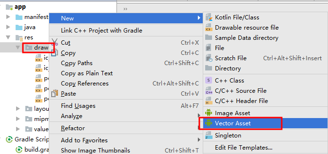
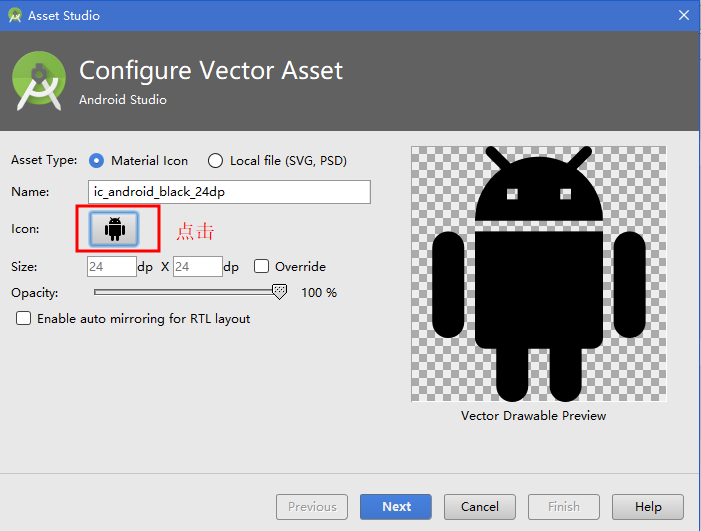

## ViewPager使用

ViewPager 是android support V4 包中的类，这个类可以让用户左右切换当前的View

1. ViewPager直接继承自ViewGroup类，它是一个容器类，可以在其中添加其他的View
2. ViewPager类需要一个PagerAdapter适配器，来为他提供数据。
3. ViewPager经常和Fragment一起使用，并且提供了专门的FragmentPagerAdapter和FragmentStatePagerAdapter类

## 下面通过一个实例掌握ViewPager的使用：

1. 在布局中添加ViewPager
```
     <?xml version="1.0" encoding="utf-8"?>
     <android.support.constraint.ConstraintLayout xmlns:android="http://schemas.android.com/apk/res/android"
         xmlns:app="http://schemas.android.com/apk/res-auto"
         xmlns:tools="http://schemas.android.com/tools"
         android:layout_width="match_parent"
         android:layout_height="match_parent"
         tools:context="cn.wang.viewpagerdemo.MainActivity">

         <android.support.v4.view.ViewPager
             android:layout_width="0dp"
             android:layout_height="0dp"
             android:layout_marginBottom="8dp"
             android:layout_marginEnd="8dp"
             android:layout_marginStart="8dp"
             android:layout_marginTop="8dp"
             app:layout_constraintBottom_toBottomOf="parent"
             app:layout_constraintEnd_toEndOf="parent"
             app:layout_constraintStart_toStartOf="parent"
             app:layout_constraintTop_toTopOf="parent" />
     </android.support.constraint.ConstraintLayout>
```
2. 加载要显示的View(方法initDatas)
```
public class MainActivity extends AppCompatActivity {
    private ViewPager viewPager;
    private ArrayList<View> viewList;
    private View view1,view2,view3;
    @Override
    protected void onCreate(Bundle savedInstanceState) {
        super.onCreate(savedInstanceState);
        setContentView(R.layout.activity_main);

        initDatas();
        initViews();
    }
    //初始化数据
    private void initDatas() {
        LayoutInflater lf = getLayoutInflater().from(this);
        view1 = lf.inflate(R.layout.layout1, null);
        view2 = lf.inflate(R.layout.layout2, null);
        view3 = lf.inflate(R.layout.layout3, null);
        viewList = new ArrayList<>();
        viewList.add(view1);
        viewList.add(view2);
        viewList.add(view3);
    }
    //初始化View组件
    private void initViews() {
        viewPager = (ViewPager)findViewById(R.id.viewPager);
    }
}
```
其中R.layout.layout1为新定义的布局，只修改了布局的背景色，代码如下：
```
<?xml version="1.0" encoding="utf-8"?>
<android.support.constraint.ConstraintLayout
    xmlns:android="http://schemas.android.com/apk/res/android" android:layout_width="match_parent"
    android:layout_height="match_parent"
    android:background="#ff0000">

</android.support.constraint.ConstraintLayout>
```
另外两个自行修改。

3. ViewPager适配器
ViewPager像ListView 等控件一样，必须要对ViewPager设置PagerAdapter来完成页面数据的绑定，这个PagerAdapter是一个适配器基类，同样有ViewPager中承载Fragment页的适配器FragmentStatePagerAdapter 以及 FragmentPagerAdapter。
实现一个最基本的PagerAdapter，需要实现以下4个方法
```
//初始化View组件
    private void initViews() {
        viewPager = (ViewPager)findViewById(R.id.viewPager);
        viewPager.setAdapter(new MyPageAdapter());
    }

    class MyPageAdapter extends PagerAdapter{

        @Override
        public int getCount() {
            return viewList.size();//返回页卡的数量
        }

        @Override
        public boolean isViewFromObject(View view, Object object) {
            return view==object;//官方提示这样写
        }
        //instantiateItem该方法的功能是创建指定位置的页面视图。finishUpdate(ViewGroup)返回前，页面应该保证被构造好
        //返回值：返回一个对应该页面的object，这个不一定必须是View，但是应该是对应页面的一些其他容器
        @Override
        public Object instantiateItem(ViewGroup container, int position) {
            container.addView(viewList.get(position), 0);//添加页卡
            return viewList.get(position);
        }
        //该方法的功能是移除一个给定位置的页面。
        @Override
        public void destroyItem(ViewGroup container, int position, Object object) {
            container.removeView(viewList.get(position));//删除页卡
        }
    }
```
运行效果如下：


### ViewPager应用一
## 欢迎界面（引导界面）


有上面的图片可以看出，主要就是添加指定数量的圆点，指示当前页面的位置。

1. 添加布局。
在ViewPager布局文件下面添加如下布局文件，由于圆点的数量不确定，所以注释掉了，将来动态添加。
```
<LinearLayout
        android:id="@+id/ll"
        android:layout_width="wrap_content"
        android:layout_height="wrap_content"
        android:layout_alignParentBottom="true"
        android:layout_centerHorizontal="true"
        android:layout_marginBottom="24dp"
        android:layout_marginRight="8dp"
        android:orientation="horizontal"
        app:layout_constraintBottom_toBottomOf="@+id/viewPager"
        app:layout_constraintEnd_toEndOf="parent"
        app:layout_constraintStart_toStartOf="parent">

        <!--<ImageView
            android:layout_width="wrap_content"
            android:layout_height="wrap_content"
            android:layout_gravity="center_vertical"
            android:clickable="true"
            android:padding="15.0dp"
            android:src="@drawable/point" />-->
    </LinearLayout>
```
2. 在initViews方法中添加代码：initPoint();此方法主要用来动态创建圆点，代码如下：
```
private void initPoint(){
        LinearLayout linearLayout = (LinearLayout) findViewById(R.id.ll);

        points = new ImageView[viewList.size()];
        //循环取得小点图片
        for (int i = 0; i < viewList.size(); i++) {
            ImageView imageView = new ImageView(this);
            LinearLayout.LayoutParams params = new LinearLayout.LayoutParams(
                    new ViewGroup.LayoutParams(ViewGroup.LayoutParams.WRAP_CONTENT,
                            ViewGroup.LayoutParams.WRAP_CONTENT));

            //为小圆点左右添加间距
            params.leftMargin = 10;
            params.rightMargin = 10;

            imageView.setBackgroundResource(R.drawable.point);
            //为LinearLayout添加ImageView
            linearLayout.addView(imageView, params);

            //得到一个LinearLayout下面的每一个子元素
            points[i] = imageView;
            //默认都设为灰色
            points[i].setEnabled(true);
            //给每个小点设置监听
            points[i].setOnClickListener(this);
            //设置位置tag，方便取出与当前位置对应
            points[i].setTag(i);
        }

        //设置当面默认的位置
        currentIndex = 0;
        //设置为白色，即选中状态
        points[currentIndex].setEnabled(false);
    }
```
其中：R.drawable.point，使用selector选择器，根据enabled状态切换显示的资源。
```
<?xml version="1.0" encoding="utf-8"?>
<selector xmlns:android="http://schemas.android.com/apk/res/android">
    <item android:state_enabled="true" android:drawable="@drawable/point_normal"/>
    <item android:state_enabled="false" android:drawable="@drawable/point_select"/>
</selector>
```

补充内容：如何创建Vector图像
1. 选中drawable，右键，如下图：



2.在弹出对话框中单击“机器人”图标，如下图：



3. 在弹出对话框中选择一个圆形，如下图：


4. 单击“OK“返回，输入Name：


完成后，代码如下：

```
<vector xmlns:android="http://schemas.android.com/apk/res/android"
        android:width="24dp"
        android:height="24dp"
        android:viewportWidth="24.0"
        android:viewportHeight="24.0">
    <path
        android:pathData="M12,12m-8,0a8,8 0,1 1,16 0a8,8 0,1 1,-16 0"
        android:fillColor="#010101"/>
</vector>
```
其中，圆点的颜色由fillColor决定，所以可以复制一份，命名为：point_select,并修改颜色。

3. 添加两个方法，第一个方法：在点击圆点时，切换ViewPager视图；第二个方法：ViewPager滑动时，切换圆点的状态。
```
    /**
     * 设置当前页面的位置
     */
    private void setCurView(int position){
        if (position < 0 || position >= viewList.size()) {
            return;
        }
        viewPager.setCurrentItem(position);
    }

    /**
     * 设置当前的小点的位置
     */
    private void setCurDot(int positon){
        Toast.makeText(this, "position:"+positon+"---"+currentIndex, Toast.LENGTH_SHORT).show();
        if (positon < 0 || positon > viewList.size() - 1 || currentIndex == positon) {
            return;
        }
        points[positon].setEnabled(false);
        points[currentIndex].setEnabled(true);

        currentIndex = positon;
    }
```
4. 在点击圆点时，可以切换相应的“视图”，需要MainActivity实现View.OnClickListener接口，并实现如下方法：
```
    /**
     * 通过点击事件来切换当前的页面
     */
    @Override
    public void onClick(View v) {
        int position = (Integer)v.getTag();
        setCurView(position);
        setCurDot(position);
    }
```
5. 在ViewPager滑动时，需要切换圆点的状态，需要实现ViewPager.OnPageChangeListener接口，代码如下：

```
    @Override
    public void onPageScrolled(int position, float positionOffset, int positionOffsetPixels) {
    }

    @Override
    public void onPageSelected(int position) {
        //设置底部小点选中状态
        setCurDot(position);
    }

    @Override
    public void onPageScrollStateChanged(int state) {
    }
```
      滑动监听器OnPageChangeListener
       OnPageChangeListener这个接口需要实现三个方法：onPageScrollStateChanged，onPageScrolled ，
       onPageSelected
           1、onPageScrollStateChanged(int state) 此方法是在状态改变的时候调用。
               其中state这个参数有三种状态（0，1，2）
                   state ==1的时表示正在滑动，state==2的时表示滑动完毕了，state==0的时表示什么都没做
                   当页面开始滑动的时候，三种状态的变化顺序为1-->2-->0
           2、onPageScrolled(int position,float positionOffset,int positionOffsetPixels) 当页面在
           滑动的时候会调用此方法，在滑动被停止之前，此方法回一直被调用。
               其中三个参数的含义分别为：
                   position :当前页面，及你点击滑动的页面
                   positionOffset:当前页面偏移的百分比
                   positionOffsetPixels:当前页面偏移的像素位置
           3、onPageSelected(int position) 此方法是页面跳转完后被调用，arg0是你当前选中的页面的
           Position（位置编号）
6. 最后，给圆点和ViewPager添加相应的监听即可。

到此为止，已经可以通过滑动ViewPager切换圆点的显示状态，而且可以通过点击圆点切换ViewPager中的页面。如果
需要页面自动跳转，可以通过如下代码实现：（添加到initViews方法的最后）
```
    Timer timer = new Timer();
        TimerTask timeTask = new TimerTask(){
            @Override
            public void run(){
                runOnUiThread(new Runnable(){
                    @Override
                    public void run(){
                        int index = viewPager.getCurrentItem();
                        index = (1 + index) % viewList.size();
                        viewPager.setCurrentItem(index, true);
                    }
                });
            }
        };
        //设置滚动时间
        timer.schedule(timeTask , 1000, 1000);
```

### 提高篇

#### PageTransformer
为ViewPager设置适配器后，就可以正常使用了，接下来我们为ViewPager增加翻页动画，毕竟人的审美会疲劳，加上一些动画交互会提高用户体验，ViewPager提供了PageTransformer接口用于实现翻页动画。
官方提供了PageTransformer的实现例子。
```
class DepthPageTransformer implements ViewPager.PageTransformer {
        private static final float MIN_SCALE = 0.75f;

        public void transformPage(View view, float position) {
            int pageWidth = view.getWidth();

            if (position < -1) { // [-Infinity,-1)
                // This page is way off-screen to the left.
                view.setAlpha(0);

            } else if (position <= 0) { // [-1,0]
                // Use the default slide transition when moving to the left page
                view.setAlpha(1);
                view.setTranslationX(0);
                view.setScaleX(1);
                view.setScaleY(1);

            } else if (position <= 1) { // (0,1]
                // Fade the page out.
                view.setAlpha(1 - position);

                // Counteract the default slide transition
                view.setTranslationX(pageWidth * -position);

                // Scale the page down (between MIN_SCALE and 1)
                float scaleFactor = MIN_SCALE
                        + (1 - MIN_SCALE) * (1 - Math.abs(position));
                view.setScaleX(scaleFactor);
                view.setScaleY(scaleFactor);

            } else { // (1,+Infinity]
                // This page is way off-screen to the right.
                view.setAlpha(0);
            }
        }
    }
```
```
class ZoomOutPageTransformer implements ViewPager.PageTransformer {
        private static final float MIN_SCALE = 0.85f;
        private static final float MIN_ALPHA = 0.5f;

        public void transformPage(View view, float position) {
            int pageWidth = view.getWidth();
            int pageHeight = view.getHeight();

            if (position < -1) { // [-Infinity,-1)
                // This page is way off-screen to the left.
                view.setAlpha(0);

            } else if (position <= 1)
            { // [-1,1]
                // Modify the default slide transition to shrink the page as well
                float scaleFactor = Math.max(MIN_SCALE, 1 - Math.abs(position));
                float vertMargin = pageHeight * (1 - scaleFactor) / 2;
                float horzMargin = pageWidth * (1 - scaleFactor) / 2;
                if (position < 0) {
                    view.setTranslationX(horzMargin - vertMargin / 2);
                } else {
                    view.setTranslationX(-horzMargin + vertMargin / 2);
                }

                // Scale the page down (between MIN_SCALE and 1)
                view.setScaleX(scaleFactor);
                view.setScaleY(scaleFactor);

                // Fade the page relative to its size.
                view.setAlpha(MIN_ALPHA + (scaleFactor - MIN_SCALE)
                        / (1 - MIN_SCALE) * (1 - MIN_ALPHA));

            } else { // (1,+Infinity]
                // This page is way off-screen to the right.
                view.setAlpha(0);
            }
        }
    }
```
```
实现翻页动画的关键就是重写transformPage方法，方法里有两个参数view和position,理解这两个参数非常重要。假设有三个页面view1，view2，view3从左至右在viewPager中显示

往左滑动时：view1，view2，view3的position都是不断变小的。
view1的position: 0 → -1 → 负无穷大
view2的position: 1 → 0 → -1
view3的position: 1 → 0
往右滑动时：view1，view2，view3的position都是不断变大的。
view1的position: -1 → 0
view2的position: -1 → 0 → 1
view3的position: 0 → 1→ 正无穷大
当position是正负无穷大时view就离开屏幕视野了。因此最核心的控制逻辑是在[-1,0]和(0,1]这两个区间，通过设置透明度，平移，旋转，缩放等动画组合可以实现各式各样的页面变化效果。
```

> 对上述示例稍加修改，即可实现App中的广告轮播效果。