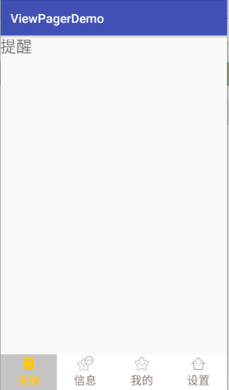
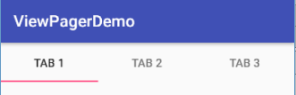

## ViewPager + Fragment

### 2.1 引言

在上一讲介绍了ViewPager的基本用法，在实际应用当中，为了避免在Activity中有大量的代码，
通常使用ViewPager和Fragment。

1. 创建新的Module：ViewPagerFragmentDemo；
2. 创建Fragment：Fragment1，代码如下：
```
 public class Fragment1 extends Fragment {
    // TODO: Rename parameter arguments, choose names that match
    // the fragment initialization parameters, e.g. ARG_ITEM_NUMBER
    private static final String ARG_PARAM1 = "param1";
    private static final String ARG_PARAM2 = "param2";

    // TODO: Rename and change types of parameters
    private String mParam1;
    private String mParam2;

    public Fragment1() {
        // Required empty public constructor
    }

    /**
     * Use this factory method to create a new instance of
     * this fragment using the provided parameters.
     *
     * @param param1 Parameter 1.
     * @param param2 Parameter 2.
     * @return A new instance of fragment Fragment1.
     */
    // TODO: Rename and change types and number of parameters
    public static Fragment1 newInstance(String param1, String param2) {
        Fragment1 fragment = new Fragment1();
        Bundle args = new Bundle();
        args.putString(ARG_PARAM1, param1);
        args.putString(ARG_PARAM2, param2);
        fragment.setArguments(args);
        return fragment;
    }

    @Override
    public void onCreate(Bundle savedInstanceState) {
        super.onCreate(savedInstanceState);
        if (getArguments() != null) {
            mParam1 = getArguments().getString(ARG_PARAM1);
            mParam2 = getArguments().getString(ARG_PARAM2);
        }
    }

    @Override
    public View onCreateView(LayoutInflater inflater, ViewGroup container,
                             Bundle savedInstanceState) {
        // Inflate the layout for this fragment
        View view = inflater.inflate(R.layout.fragment1, container, false);
        TextView tv = (TextView) view.findViewById(R.id.textView);
        tv.setText(mParam1);
        tv.setTextSize(25);
        return view;
    }
    @Override
    public void onAttach(Context context) {
        super.onAttach(context);
    }
    @Override
    public void onDetach() {
        super.onDetach();
    }
}
```
3. 在MainActivity的布局文件中添加ViewPager组件；
4. 在MainActivity中添加数据的初始化代码，代码如下：
```
public class MainActivity extends AppCompatActivity {
    private Fragment fragment1,fragment2,fragment3;
    private List<Fragment> mFragments = new ArrayList<Fragment>();
    private ViewPager viewPager;
    @Override
    protected void onCreate(Bundle savedInstanceState) {
        super.onCreate(savedInstanceState);
        setContentView(R.layout.activity_main);

        initDatas();
        initViews();
    }

    private void initViews() {
        viewPager = (ViewPager)findViewById(R.id.viewPager);
        //viewPager.setAdapter(new MyAdapter(getSupportFragmentManager()));
        viewPager.setAdapter(new MyAdapter1(getSupportFragmentManager()));
    }

    private void initDatas() {
        fragment1 = Fragment1.newInstance("First","");
        fragment2 = Fragment1.newInstance("Second","");
        fragment3 = Fragment1.newInstance("Third","");
        mFragments.add(fragment1);
        mFragments.add(fragment2);
        mFragments.add(fragment3);
    }
}
```
5. 定义适配器

PagerAdapter是android.support.v4包中的类，它的子类有FragmentPagerAdapter, FragmentStatePagerAdapter，
相比通用的 PagerAdapter，后两个adapter 专注于每一页均为 Fragment 的情况。

故创建的适配器可以继承FragmentPagerAdapter，代码如下：

```
class MyAdapter extends FragmentPagerAdapter{

        public MyAdapter(FragmentManager fm) {
            super(fm);
        }

        @Override
        public Fragment getItem(int position) {
            return mFragments.get(position);
        }

        @Override
        public int getCount() {
            return mFragments.size();
        }
    }
```
也可以继承FragmentStatePagerAdapter，代码如下：
```
class MyAdapter1 extends FragmentStatePagerAdapter{

        public MyAdapter1(FragmentManager fm) {
            super(fm);
        }

        @Override
        public Fragment getItem(int position) {
            return mFragments.get(position);
        }

        @Override
        public int getCount() {
            return mFragments.size();
        }
    }
```

那么二者有什么区别呢？

**二者的区别 ：**

FragmentPagerAdapter类内的每一个生成的 【Fragment】 都将保存在内存之中，因此适用于那些相对静态、数量
也比较少的那种。比如说一个有3-5个tab标签的fragment滑动界面，FragmentPagerAdapter会对我们浏览过所有Fragment
进行缓存，保存这些界面的临时状态，这样当我们左右滑动的时候，界面切换更加的流畅。但是，这样也会增加程序占用的内存。

> 注意，上面所说的FragmentPagerAdapter只是会把【Fragment本身】保存在内存中，而不会把
【Fragment中的View】也保存在内存中。实际上，除了当前页面及左右相邻两个页面中的Fragment
中的【View】会被保存到内存中外，其余Fragment中的【View】都会销毁。也即所有浏览过的
Fragment的【onDestroy】方法都不会被调用，但是除了当前页面及左右相邻两个页面外，
Fragment的【onDestroyView】方法都会被调用。

> 如果需要处理有很多页，并且数据动态性较大、占用内存较多的情况，应该使用FragmentStatePagerAdapter。
FragmentStatePagerAdapter也是PagerAdapter的子类，这个适配器对实现多个Fragment
界面的滑动是非常有用的。它的工作方式和listview是非常相似的，当Fragment对用户不可见的时候，整个
Fragment会被销毁(当然，为了保证滑动时流畅，和所有PagerAdapter一样，左右两个页面的Fragment会被保留)，
而不像FragmentPagerAdapter那样，只是销毁Fragment中的View。

6. 可以切换initViews方法中的第二和第三条语句，查看使用两个适配器运行的效果。

### 2.2 添加底部导航栏
虽然上面的程序可以正常工作，但是我们经常看到的App是这样的：



下面，介绍如何添加底部导航栏。

1. 将MainActivity复制一份为：MainActivityAndBottom，同时修改其布局文件为：activity_main_bottom；
2. 修改activity_main_bottom布局文件，添加底部导航栏，在此使用RadioButton来实现，因为RadioButton具有
互相排斥的属性，一组只能选中一个。布局文件如下：
```
<?xml version="1.0" encoding="utf-8"?>
<android.support.constraint.ConstraintLayout xmlns:android="http://schemas.android.com/apk/res/android"
    xmlns:app="http://schemas.android.com/apk/res-auto"
    xmlns:tools="http://schemas.android.com/tools"
    android:layout_width="match_parent"
    android:layout_height="match_parent"
    tools:context="cn.wang.viewpagerdemo.MainActivity">

    <RadioGroup
        android:id="@+id/rg_tab_bar"
        android:layout_width="match_parent"
        android:layout_height="56dp"
        android:background="@color/bg_white"
        android:orientation="horizontal"
        app:layout_constraintBottom_toBottomOf="parent">

        <RadioButton
            android:id="@+id/rb_channel"
            style="@style/tab_menu_item"
            android:drawableTop="@drawable/tab_menu_channel"
            android:text="@string/tab_menu_alert" />

        <RadioButton
            android:id="@+id/rb_message"
            style="@style/tab_menu_item"
            android:drawableTop="@drawable/tab_menu_message"
            android:text="@string/tab_menu_message" />

        <RadioButton
            android:id="@+id/rb_better"
            style="@style/tab_menu_item"
            android:drawableTop="@drawable/tab_menu_better"
            android:text="@string/tab_menu_mine" />

        <RadioButton
            android:id="@+id/rb_setting"
            style="@style/tab_menu_item"
            android:drawableTop="@drawable/tab_menu_setting"
            android:text="@string/tab_menu_setting" />

    </RadioGroup>

    <android.support.v4.view.ViewPager
        android:id="@+id/viewPager"
        android:layout_width="0dp"
        android:layout_height="0dp"
        app:layout_constraintBottom_toTopOf="@+id/rg_tab_bar"
        app:layout_constraintHorizontal_bias="1.0"
        app:layout_constraintLeft_toLeftOf="parent"
        app:layout_constraintRight_toRightOf="parent"
        app:layout_constraintTop_toTopOf="parent" />

</android.support.constraint.ConstraintLayout>

```
3. 修改MainActivityAndBottom文件，代码如下：
```
public class MainActivityAndBottom extends AppCompatActivity
        implements RadioGroup.OnCheckedChangeListener,ViewPager.OnPageChangeListener{
    private Fragment fragment1,fragment2,fragment3,fragment4;
    private List<Fragment> mFragments = new ArrayList<Fragment>();
    private ViewPager viewPager;

    private RadioGroup rg_tab_bar;
    private RadioButton rb_channel;
    private RadioButton rb_message;
    private RadioButton rb_better;
    private RadioButton rb_setting;
    @Override
    protected void onCreate(Bundle savedInstanceState) {
        super.onCreate(savedInstanceState);
        setContentView(R.layout.activity_main_bottom);

        initDatas();
        initViews();
        rb_channel.setChecked(true);
    }

    private void initViews() {
        rg_tab_bar = (RadioGroup) findViewById(R.id.rg_tab_bar);
        rb_channel = (RadioButton) findViewById(R.id.rb_channel);
        rb_message = (RadioButton) findViewById(R.id.rb_message);
        rb_better = (RadioButton) findViewById(R.id.rb_better);
        rb_setting = (RadioButton) findViewById(R.id.rb_setting);
        rg_tab_bar.setOnCheckedChangeListener(this);

        viewPager = (ViewPager)findViewById(R.id.viewPager);
        //viewPager.setAdapter(new MyAdapter(getSupportFragmentManager()));
        viewPager.setAdapter(new MyAdapter1(getSupportFragmentManager()));
        viewPager.setCurrentItem(0);
        viewPager.addOnPageChangeListener(this);
    }

    private void initDatas() {
        fragment1 = Fragment1.newInstance(getResources().getString(R.string.tab_menu_alert),"");
        fragment2 = Fragment1.newInstance(getResources().getString(R.string.tab_menu_message),"");
        fragment3 = Fragment1.newInstance(getResources().getString(R.string.tab_menu_mine),"");
        fragment4 = Fragment1.newInstance(getResources().getString(R.string.tab_menu_setting),"");
        mFragments.add(fragment1);
        mFragments.add(fragment2);
        mFragments.add(fragment3);
        mFragments.add(fragment4);
    }

    @Override
    public void onCheckedChanged(RadioGroup group, int checkedId) {
        switch (checkedId) {
            case R.id.rb_channel:
                viewPager.setCurrentItem(0);
                break;
            case R.id.rb_message:
                viewPager.setCurrentItem(1);
                break;
            case R.id.rb_better:
                viewPager.setCurrentItem(2);
                break;
            case R.id.rb_setting:
                viewPager.setCurrentItem(3);
                break;
        }
    }

    @Override
    public void onPageScrolled(int position, float positionOffset, int positionOffsetPixels) {

    }

    @Override
    public void onPageSelected(int position) {

    }

    @Override
    public void onPageScrollStateChanged(int state) {
        //state的状态有三个，0表示什么都没做，1正在滑动，2滑动完毕
        if (state == 2) {
            switch (viewPager.getCurrentItem()) {
                case 0:
                    rb_channel.setChecked(true);
                    break;
                case 1:
                    rb_message.setChecked(true);
                    break;
                case 2:
                    rb_better.setChecked(true);
                    break;
                case 3:
                    rb_setting.setChecked(true);
                    break;
            }
        }
    }


    class MyAdapter extends FragmentPagerAdapter{

        public MyAdapter(FragmentManager fm) {
            super(fm);
        }

        @Override
        public Fragment getItem(int position) {
            return mFragments.get(position);
        }

        @Override
        public int getCount() {
            return mFragments.size();
        }
    }
    class MyAdapter1 extends FragmentStatePagerAdapter{

        public MyAdapter1(FragmentManager fm) {
            super(fm);
        }

        @Override
        public Fragment getItem(int position) {
            return mFragments.get(position);
        }

        @Override
        public int getCount() {
            return mFragments.size();
        }
    }
}
```

### 2.3 TabLayout
TabLayout是Android 5.0新增的一个组件，提供了一个水平的布局用来展示Tabs。
#### 2.3.1 TabLayout简单使用
1. 新建一个Activity：TabLayoutActivity，在布局文件中添加TabLayout组件，代码如下：
```
<?xml version="1.0" encoding="utf-8"?>
<android.support.constraint.ConstraintLayout xmlns:android="http://schemas.android.com/apk/res/android"
    xmlns:app="http://schemas.android.com/apk/res-auto"
    xmlns:tools="http://schemas.android.com/tools"
    android:layout_width="match_parent"
    android:layout_height="match_parent"
    tools:context="cn.wang.viewpagerdemo.MainActivity">
    <android.support.design.widget.TabLayout
        android:id="@+id/tabLayout"
        android:layout_width="match_parent"
        android:layout_height="wrap_content"
        app:layout_constraintLeft_toLeftOf="parent"
        app:layout_constraintTop_toTopOf="parent">

    </android.support.design.widget.TabLayout>
</android.support.constraint.ConstraintLayout>
```
2. 在OnCreate方法中添加如下代码：
```
        tabLayout= (TabLayout) findViewById(R.id.tabLayout);
        tabLayout.addTab(tabLayout.newTab().setText("Tab 1"));
        tabLayout.addTab(tabLayout.newTab().setText("Tab 2"));
        tabLayout.addTab(tabLayout.newTab().setText("Tab 3"));
```
运行效果如下：



#### 2.3.2 ViewPager+TabLayout实现导航效果

1. 在2.3.1的布局文件TabLayout组件的下面添加如下代码：
```
<android.support.v4.view.ViewPager
        android:id="@+id/viewPager"
        android:layout_width="0dp"
        android:layout_height="0dp"
        app:layout_constraintBottom_toBottomOf="parent"
        app:layout_constraintLeft_toLeftOf="parent"
        app:layout_constraintRight_toRightOf="parent"
        app:layout_constraintTop_toBottomOf="@+id/tabLayout" />
```
2. 将tabLayout和viewPager绑定（方法的最后一行）
```
    private void initViews() {
        viewPager = (ViewPager)findViewById(R.id.viewPager);
        viewPager.setAdapter(new MyAdapter(getSupportFragmentManager()));
//        viewPager.setAdapter(new MyAdapter1(getSupportFragmentManager()));
        tabLayout= (TabLayout) findViewById(R.id.tabLayout);
        tabLayout.setupWithViewPager(viewPager);
    }
```
3. 在适配器中添加如下代码：
```
        @Override
        public CharSequence getPageTitle(int position) {
            return titles[position];
        }
```
该方法的返回值将显示在Tabs中，如上例的“Tab 1”。

